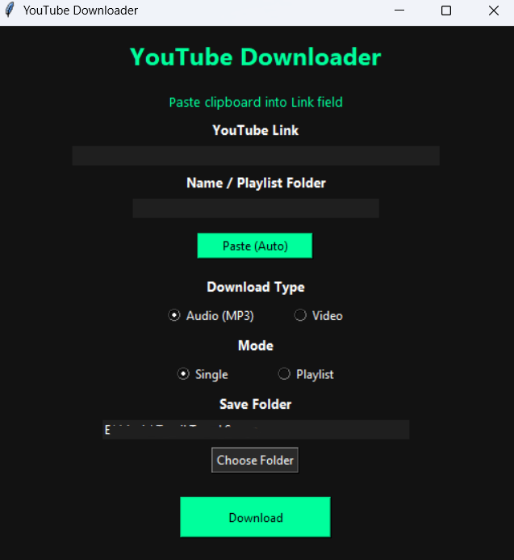

# YouTube Downloader - Complete Guide

## 📋 Table of Contents
1. [Overview](#overview)
2. [Features](#features)
3. [System Requirements](#system-requirements)
4. [Installation & Setup](#installation--setup)
5. [How It Works](#how-it-works)
6. [Usage Guide](#usage-guide)
7. [Improvements Made](#improvements-made)
8. [Troubleshooting](#troubleshooting)

---

## 🎯 Overview

**YouTube Downloader** is a Python-based desktop application with a graphical user interface (GUI) that allows you to download YouTube videos or extract audio (MP3) from YouTube videos. It supports both single videos and entire playlists.

### Key Capabilities:
- Download audio (MP3) or video (MP4)
- Choose from multiple video quality options (360p, 480p, 720p, 1080p)
- Download single videos or entire playlists
- Track download progress in real-time
- Choose custom save locations
- User-friendly dark-themed interface

---

## ✨ Features

| Feature | Description |
|---------|-------------|
| **Audio Download** | Extract audio from YouTube videos as MP3 files |
| **Video Download** | Download videos in MP4 format with selectable quality |
| **Playlist Support** | Download entire playlists with organized folder structure |
| **Progress Tracking** | Real-time progress bar showing download percentage |
| **Auto Paste** | Quickly paste URLs and names from clipboard |
| **Custom Folder** | Choose where to save downloaded files |
| **Quality Selection** | Select video quality from 360p to 1080p |
| **Dark Theme** | Modern, easy-on-the-eyes dark interface |

### User Interface



---

## 🖥️ System Requirements

### Minimum Requirements:
- **Python**: 3.8 or higher
- **RAM**: 500 MB minimum (1 GB recommended)
- **Storage**: At least 100 MB free space
- **OS**: Windows, macOS, or Linux

### Required Software:
1. **Python 3.8+** - [Download from python.org](https://www.python.org/downloads/)
2. **FFmpeg** - Required for MP3 conversion (audio downloads)
3. **pip** - Python package manager (usually comes with Python)

---

## 📦 Installation & Setup

### Step 1: Install Python
1. Download Python 3.8+ from [python.org](https://www.python.org/downloads/)
2. Run the installer
3. **IMPORTANT**: Check the box "Add Python to PATH"
4. Click Install

### Step 2: Install FFmpeg

#### Windows:
**Option A - Using Chocolatey (Easiest)**
```powershell
choco install ffmpeg
```

**Option B - Manual Download**
1. Go to [ffmpeg.org/download.html](https://ffmpeg.org/download.html)
2. Download the Windows build
3. Extract to a folder (e.g., `C:\ffmpeg`)
4. Add `C:\ffmpeg\bin` to your system PATH environment variable

#### macOS:
```bash
brew install ffmpeg
```

#### Linux (Ubuntu/Debian):
```bash
sudo apt-get install ffmpeg
```

### Step 3: Install Required Python Packages

1. Open PowerShell/Terminal
2. Navigate to your project folder:
   ```powershell
   cd "E:\YT"
   ```

3. Install dependencies:
   ```powershell
   pip install yt-dlp
   ```

   If you want to install multiple packages at once:
   ```powershell
   pip install yt-dlp==2024.1.1
   ```

### Step 4: Configure Default Save Location

Edit `YTD.py` and change this line to your preferred folder:
```python
DEFAULT_SAVE = r"E:\Music\Tamil Travel Songs"  # Change this path
```

### Step 5: Run the Application

```powershell
python YTD.py
```

The application window should open with the GUI interface.

### Step 6 (Optional): Create a Standalone Executable

You can package the application into a standalone `.exe` file that can run without Python installed on the target system.

#### Install PyInstaller:
```powershell
pip install pyinstaller
```

#### Build the Executable:
```powershell
pyinstaller --onefile --windowed YTD.py
```

This command:
- `--onefile`: Creates a single executable file instead of a folder
- `--windowed`: Hides the console window (GUI only, no black command prompt)

#### Find Your Executable:
The compiled app will be located in:
```
YTD/dist/YTD.exe
```

You can now:
- Copy `YTD.exe` to another computer with Windows
- Run it directly without needing Python installed
- Create a shortcut on your desktop for easy access

**Note**: The first run may take a moment as the application unpacks itself.

---

## 🔍 How It Works

### Architecture Overview

```
┌─────────────────────────────────────────┐
│     YouTube Downloader GUI (Tkinter)    │
├─────────────────────────────────────────┤
│                                         │
│  User Input   → Validation → Processing │
│  (URL, Name)                            │
│                                         │
│  UI Updates ← Threading ← yt-dlp API    │
│  (Progress Bar)                         │
│                                         │
├─────────────────────────────────────────┤
│         FFmpeg (Audio Conversion)       │
├─────────────────────────────────────────┤
│    Saved Files (MP3 or MP4)             │
└─────────────────────────────────────────┘
```

### Component Breakdown

#### 1. **User Interface (Tkinter)**
- Displays input fields for YouTube URL and file name
- Shows quality/format selection options
- Displays real-time progress bar
- Provides folder browsing functionality

#### 2. **Input Validation**
```python
# Checks for:
- Empty URL field
- Empty name field
- Folder existence and write permissions
- Clipboard access
```

#### 3. **Download Processing**
```python
# Flow:
URL Input → yt-dlp Library
         ↓
Select Format (Audio/Video)
         ↓
Select Quality (if video)
         ↓
FFmpeg Processing (if audio)
         ↓
Save to Folder
         ↓
Update Progress
```

#### 4. **Threading**
- Downloads run in a separate thread to keep UI responsive
- Main thread remains non-blocking during long operations
- Progress updates are safely pushed to GUI

### Key Functions

| Function | Purpose |
|----------|---------|
| `paste_auto()` | Alternates pasting clipboard content to URL and Name fields |
| `download()` | Validates inputs and initiates download process |
| `progress_hook()` | Tracks download progress and updates progress bar |
| `progress_hook()` | Extracts progress percentage from yt-dlp status |
| `reset_ui()` | Clears input fields and hides progress bar |
| `toggle_quality()` | Shows/hides quality selector based on media type |
| `choose_folder()` | Opens folder browser dialog |

---

## 📖 Usage Guide

### Basic Download (Single Video - Audio)

1. **Open the Application**
   ```powershell
   python YTD.py
   ```

2. **Enter YouTube URL**
   - Find a YouTube video you want to download
   - Copy its URL (e.g., `https://www.youtube.com/watch?v=...`)
   - Click "Paste (Auto)" or paste manually into "YouTube Link" field

3. **Enter Download Name**
   - Click "Paste (Auto)" again to paste a name from clipboard
   - Or manually type a filename without extension

4. **Select Download Type**
   - Keep "Audio (MP3)" selected for audio
   - The video quality option will be hidden for audio

5. **Verify Save Folder**
   - The default folder shows in "Save Folder"
   - Click "Choose Folder" to change location

6. **Click Download**
   - Watch the progress bar fill up
   - Once finished, you'll see "Download Finished ✔"
   - Audio file is saved with auto-generated extension

### Download with Video Quality Selection

1. **Select "Video"** option under Download Type
2. **Choose Quality**
   - The quality selector now appears
   - Select desired resolution: 360p, 480p, 720p, or 1080p
   - *Note: Higher quality = larger file size and longer download time*

3. **Same steps as audio download for remaining steps**

### Download Entire Playlist

1. **Copy Playlist URL**
   - Go to YouTube Playlist
   - Copy the playlist URL

2. **In the Application:**
   - Paste URL using "Paste (Auto)" or manually
   - Enter folder name where to save all videos
   - Select **"Playlist"** under Mode
   - Each video will be saved in a subfolder structure

3. **Select Format & Quality**
   - Choose Audio or Video
   - Select quality if video is chosen

4. **Download**
   - The app will download all videos in the playlist
   - Progress updates for each video

---

## 🔧 Improvements Made

### Code Quality Enhancements

#### 1. **Better Error Handling**
- **Before**: Bare `except:` statements that masked errors
- **After**: Specific exception handling with user-friendly error messages
  ```python
  # Now shows error dialogs instead of silently failing
  except tk.TclError:
      messagebox.showerror("Error", "Unable to access clipboard")
  ```

#### 2. **Input Validation**
- **Before**: No validation, would crash on empty inputs
- **After**: Comprehensive checks before processing
  ```python
  if not url:
      messagebox.showerror("Error", "Please enter a YouTube URL")
      return
  if not os.access(save_path, os.W_OK):
      messagebox.showerror("Error", "No write permission")
  ```

#### 3. **Configuration Constants**
- **Before**: Magic strings and colors scattered throughout code
- **After**: Centralized constants for easy maintenance
  ```python
  ACCENT_COLOR = "#00ff9c"
  BG_COLOR = "#121212"
  WINDOW_WIDTH = 520
  ```

#### 4. **Enhanced Threading**
- **Before**: Thread exceptions were silently ignored
- **After**: Proper exception handling in threaded code
  ```python
  except Exception as e:
      root.after(0, lambda: messagebox.showerror("Download Error", f"Error: {str(e)}"))
  ```

#### 5. **User Feedback**
- **Before**: No output when buttons clicked
- **After**: Status updates and help text
  ```python
  # Now shows "Paste clipboard into Name field" after first paste
  status_label.config(text="Paste clipboard into Name field")
  ```

#### 6. **Better Audio Quality**
- **Before**: `'preferredquality': '0'` (lowest)
- **After**: `'preferredquality': '192'` (standard quality)

#### 7. **Folder Permission Checks**
- **Before**: Would fail at runtime if folder not writable
- **After**: Pre-checks permissions and folder existence
  ```python
  if not os.path.exists(save_path):
      os.makedirs(save_path, exist_ok=True)
  ```

#### 8. **Code Documentation**
- Added docstrings to all functions
- Better code organization and comments
- Clearer variable names

---

## ❓ Troubleshooting

### Problem: "Module 'yt_dlp' not found"
**Solution:**
```powershell
pip install yt-dlp
```

### Problem: "FFmpeg not found" (during MP3 conversion)
**Solution:**
1. Install FFmpeg (see [Installation](#step-2-install-ffmpeg) section)
2. Verify installation:
   ```powershell
   ffmpeg -version
   ```
3. If still not working, add FFmpeg to PATH environment variables

### Problem: "Cannot access clipboard"
**Solution:**
- This is a Tkinter issue on some systems
- Try restarting the application
- Or manually paste content instead of using "Paste (Auto)"

### Problem: "No write permission for selected folder"
**Solution:**
1. Click "Choose Folder" to select a different location
2. Ensure the selected folder has write permissions
3. Try a folder in your user directory (e.g., `C:\Users\YourName\Downloads`)

### Problem: Download speed is slow
**Solution:**
1. Check your internet connection
2. Try downloading at a different time
3. Reduce video quality if downloading video
4. Close other applications taking bandwidth

### Problem: "Unable to access clipboard"
**Solution:**
- Manually copy-paste instead of using "Paste (Auto)"
- Or type the URL/name directly into fields

### Problem: Application crashes
**Solution:**
1. Check the console for error messages
2. Ensure all dependencies are installed:
   ```powershell
   pip install --upgrade yt-dlp
   ```
3. Update Python to latest version
4. Try with a different YouTube URL

---

## 📝 Configuration Tips

### Changing Default Save Location

Edit this line in `YTD.py`:
```python
DEFAULT_SAVE = r"E:\Music\Tamil Travel Songs"
```

Change to your preferred path:
```python
DEFAULT_SAVE = r"C:\Users\YourName\Downloads"
# OR
DEFAULT_SAVE = r"D:\Videos"
```

### Customizing Colors

Edit these constants at the top:
```python
ACCENT_COLOR = "#00ff9c"      # Green (buttons & progress)
BG_COLOR = "#121212"          # Dark background
FG_COLOR = "white"            # Text color
SECONDARY_BG = "#1f1f1f"      # Input field background
TERTIARY_BG = "#2a2a2a"       # Button background
```

### Adjusting Window Size

```python
WINDOW_WIDTH = 520
WINDOW_HEIGHT = 650
```

---

## 🎓 Learning Resources

- **yt-dlp Documentation**: https://github.com/yt-dlp/yt-dlp
- **Tkinter Guide**: https://docs.python.org/3/library/tkinter.html
- **FFmpeg Guide**: https://ffmpeg.org/documentation.html
- **Threading in Python**: https://docs.python.org/3/library/threading.html

---

## ⚠️ Important Notes

1. **Respect Copyright**: Only download content you have permission to download. Always respect creators' intellectual property rights.

2. **Terms of Service**: Using this tool must comply with YouTube's Terms of Service. Downloading copyrighted content without permission may be illegal in your jurisdiction.

3. **Storage**: Video files can be large (100MB - 1GB+). Ensure you have sufficient storage space.

4. **Internet**: Large downloads may consume significant bandwidth and time. Use responsibly on metered connections.

5. **Updates**: yt-dlp is regularly updated to work with YouTube changes:
   ```powershell
   pip install --upgrade yt-dlp
   ```

---

## 🚀 Future Enhancement Ideas

- [ ] Download entire channel
- [ ] Subtitle download support
- [ ] Custom audio codec selection
- [ ] Batch URL processing
- [ ] Download history/favorites
- [ ] Speed limit control
- [ ] Proxy support
- [ ] Database of downloaded videos

---

## 📧 Support

If you encounter issues:
1. Check the Troubleshooting section above
2. Verify all dependencies are installed
3. Check your YouTube URL is valid
4. Ensure FFmpeg is properly installed
5. Try updating yt-dlp: `pip install --upgrade yt-dlp`

---

**Happy Downloading!** 🎉

*Last Updated: March 2026*
*Application: YouTube Downloader v1.0*
